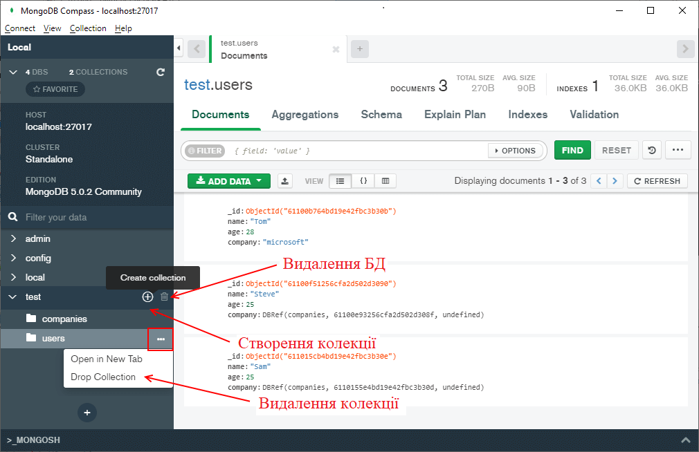
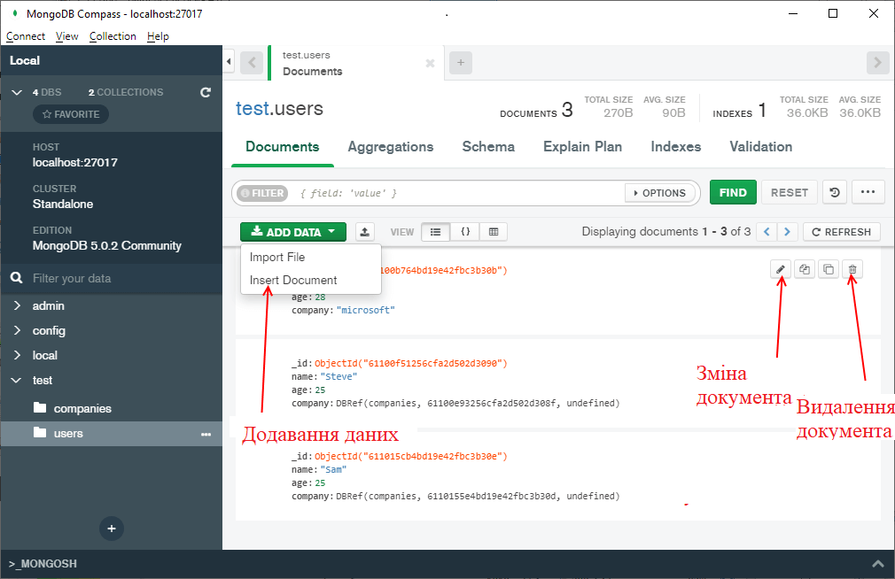
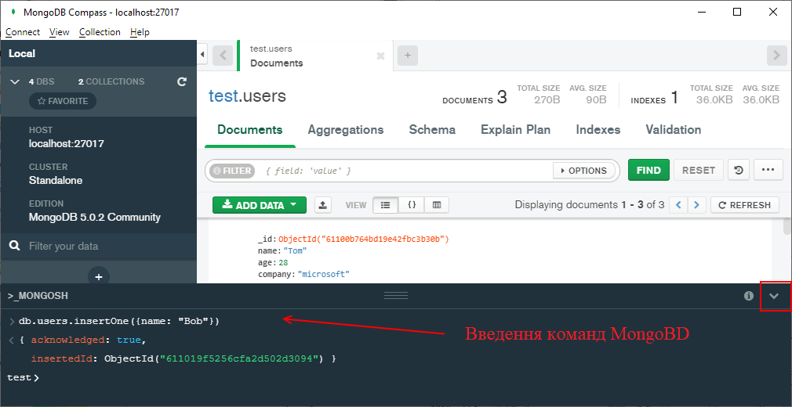
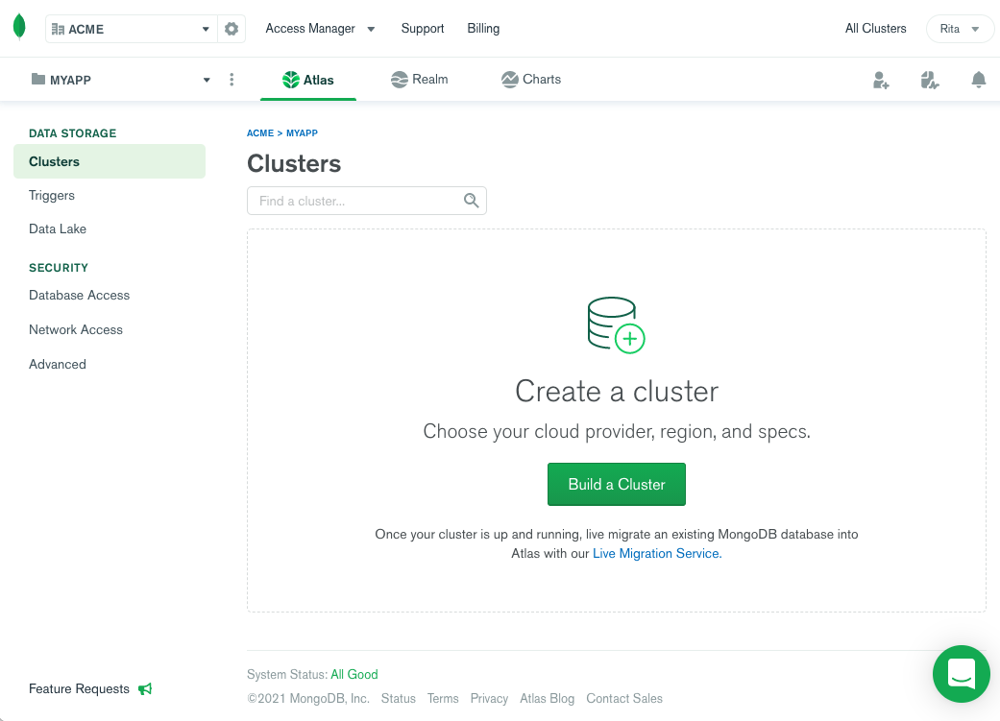
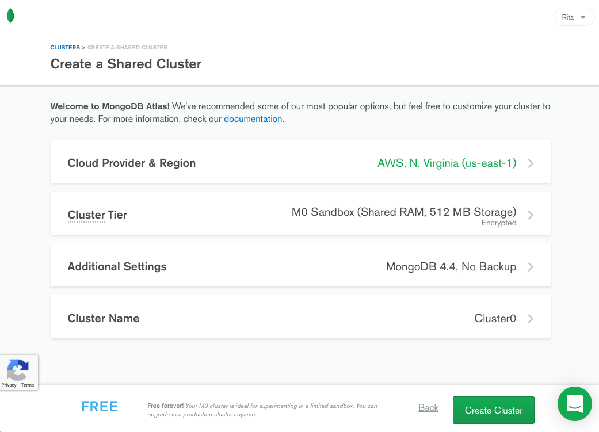
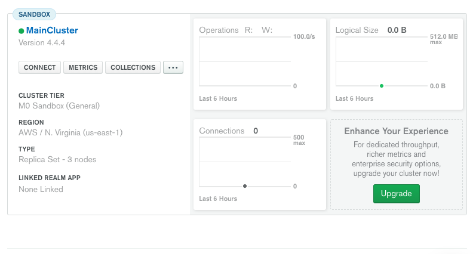
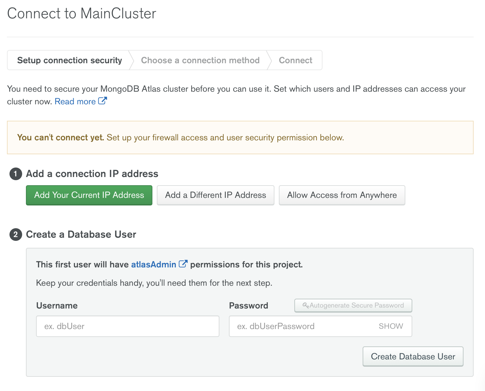
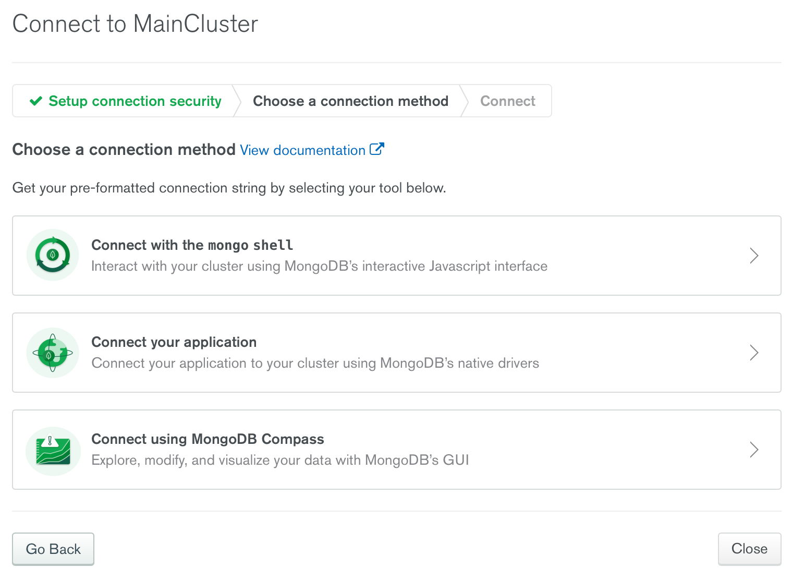
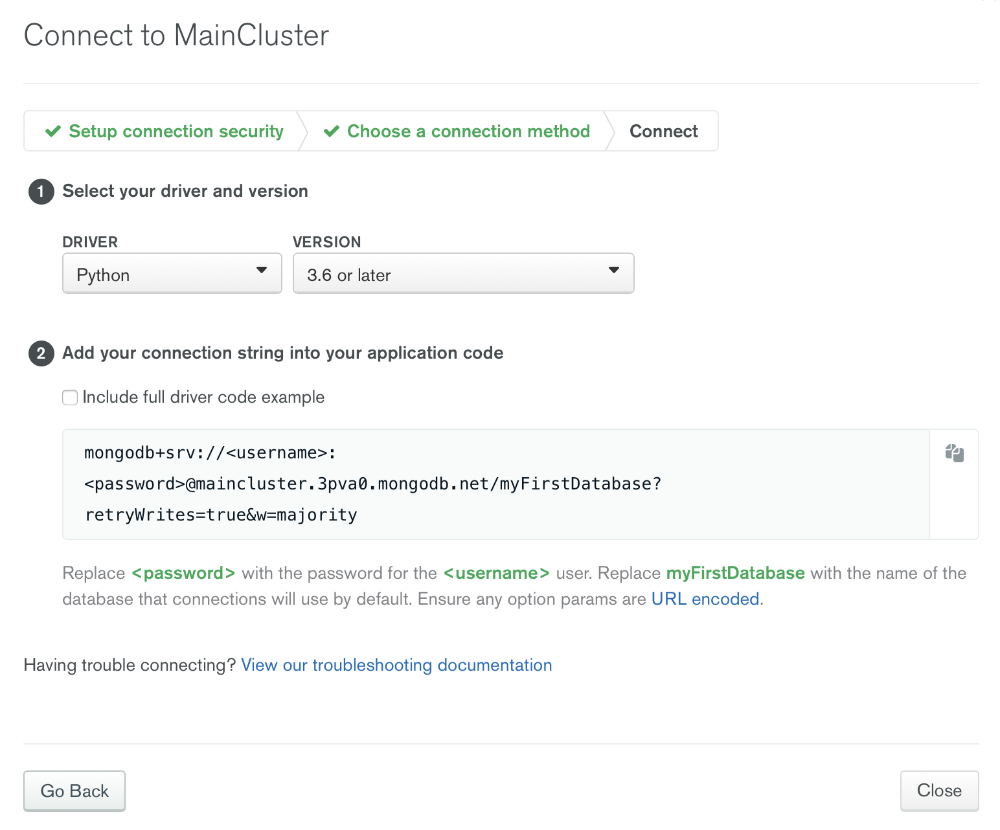
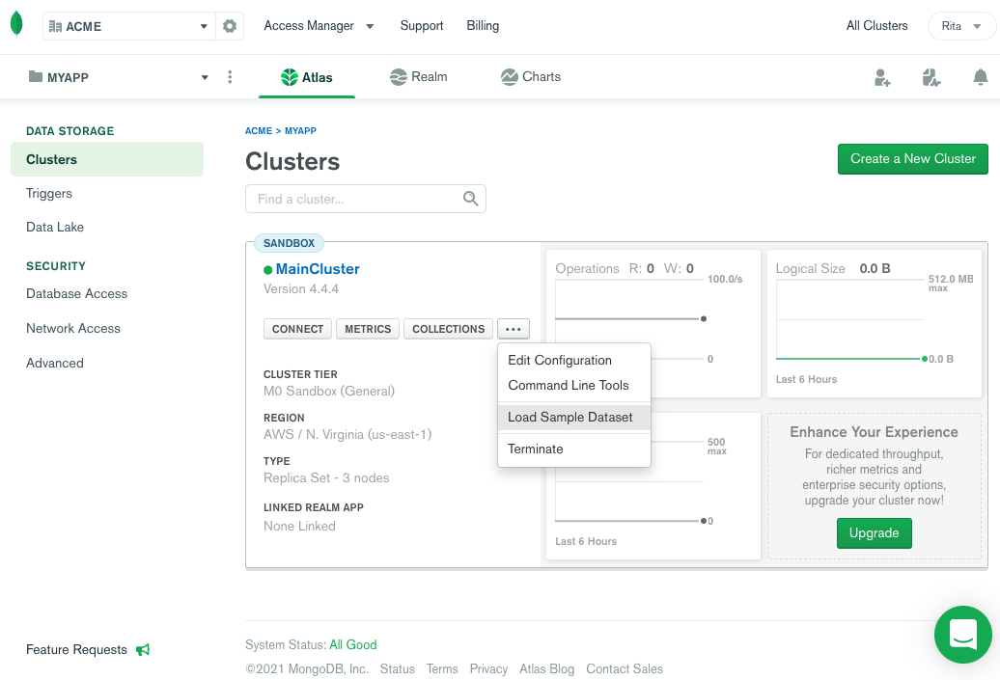

Доповідь підготували:

студент 2-го курсу, групи ІМ-23 **Катинський Ілля** [Пошта illya2005y@gmail.com, [Телеграм](https://t.me/girostark)]
студент 2-го курсу, групи ІМ-23 **Стреля Ілля** [Пошта seylvin2005@gmail.com, [Телеграм](https://t.me/lashus)]

Керівник

доцент кафедри ОТ ФІОТ, к.т.н., доцент Андрій БОЛДАК

НТУУ "КИЇВСЬКИЙ ПОЛІТЕХНІЧНИЙ ІНСТИТУТ імені ІГОРЯ СІКОРСЬКОГО

Факультет інформатики та обчислювальної техніки

Кафедра обчислювальної техніки

Київ

# Нереляційна база даних MongoDB, конвеєр агрегації, багатохмарна служба баз даних MongoDB Atlas і GUI для керування даними MongoDB Compass

## Що таке нереляційна база даних?

Нереляційна база даних (NoSQL) – це база даних, яка зберігає дані без чітких зв'язків між собою та без чіткої структури. Бази даних NoSQL спеціально побудовані для конкретних моделей даних і мають гнучкі графіки побудови сучасних додатків. Бази даних NoSQL широко визнані своєю простотою розробки, функціональністю та продуктивністю для Великий даних. Вони використовують різноманітні моделі даних, включаючи документ, діаграму, значення ключа, в пам'яті та пошук.
Бази даних NoSQL використовують різноманітні моделі даних для доступу та керування даними, такими як документи, діаграми, значення ключів, у пам’яті та пошук. Крім того, ці типи баз даних спеціально оптимізовані для програм, які потребують великого обсягу даних, низька затримка і гнучкі моделі даних. Ми досягаємо цього, зокрема, полегшуючи деякі обмеження узгодженості даних, відомі в інших базах даних.

## Що таке MongoDB?


**MongoDB** - це потужна, гнучка та високопродуктивна система керування базами даних (СКБД), яка базується на моделі документа. Її основна особливість полягає у зберіганні даних у вигляді документів у форматі JSON-подібних об'єктів. MongoDB розроблена таким чином, щоб працювати з великими об'ємами даних, забезпечуючи гнучкість у роботі з структурами даних та швидкодію в операціях зберігання та витягування інформації.

Історія MongoDB почалася у 2007 році, коли компанія 10gen (пізніше перейменована на MongoDB Inc.) розпочала розробку цієї бази даних. Вона була випущена у відкритий доступ у 2009 році. MongoDB швидко набула популярності завдяки своїй простоті використання, гнучкості схеми даних та здатності працювати з великими об'ємами інформації.

Ця система СКБД використовує механізм розподілення даних, що дозволяє їй масштабуватись горизонтально, тобто додавати нові сервери для обробки даних у реальному часі без значного збою в роботі. MongoDB також підтримує ряд функцій, таких як індексація, реплікація та геопросторові запити, що робить її популярним вибором для великої кількості застосувань, включаючи веб-розробку, аналітику, системи керування контентом та багато іншого.


## Що таке MongoDB Atlas?


**MongoDB Atlas** - це облачна платформа для керування базами даних, від тих самих людей, які створили MongoDB створена для спрощення розгортання, керування та масштабування баз даних MongoDB. Цей сервіс надає можливість створення та управління кластерами MongoDB в облачних середовищах без необхідності власних фізичних серверів чи інфраструктури. Atlas спрощує розгортання та керування вашими базами даних, пропонуючи при цьому універсальність, необхідну для створення відмовостійких та продуктивних глобальних додатків у хмарних провайдерів на ваш вибір.

### Основні характеристики MongoDB Atlas:

* **Легкість використання**: Платформа надає інтуїтивний інтерфейс, що дозволяє легко створювати, налаштовувати та управляти кластерами баз даних MongoDB без глибоких знань щодо адміністрування баз даних.

* **Облачне рішення**: MongoDB Atlas працює в облачному середовищі, співпрацюючи з провайдерами хмарних послуг, такими як AWS, Google Cloud, Microsoft Azure тощо, що дозволяє швидко розгортати бази даних у відповідних областях.

* **Масштабованість**: Платформа дозволяє легко масштабувати бази даних вгору чи вниз, змінюючи ресурси, що сприяє адаптації до потреб вашого додатку в реальному часі.

* **Надійність та безпека**: MongoDB Atlas забезпечує високу доступність через механізми реплікації та автоматичного резервного копіювання. Вона також пропонує широкі можливості безпеки, такі як шифрування даних у спокої та під час передачі, контроль доступу тощо.

* **Глобальна доступність**: Завдяки співпраці з облачними провайдерами по всьому світу, MongoDB Atlas дозволяє створювати кластери даних у різних регіонах, щоб забезпечити швидкий доступ та зменшити затримки для користувачів з різних частин світу.

MongoDB Atlas використовується як для малих стартапів, так і для великих корпорацій, оскільки вона пропонує простоту управління, надійність та гнучкість, які необхідні для сучасних додатків та систем.


## Що таке MongoDB Compass?


**MongoDB Compass** - це потужний графічний інтерфейс (GUI) для запитів, агрегації та аналізу даних MongoDB у візуальному середовищі. Цей інструмент, призначений для взаємодії з базами даних через графічний інтерфейс, дозволяючи адміністраторам, розробникам та аналітикам легше виконувати різноманітні завдання, пов'язані з управлінням та аналізом даних у MongoDB.


### Основні можливості MongoDB Compass:

* **Візуальний інтерфейс користувача**: MongoDB Compass надає інтуїтивний і графічний інтерфейс, що полегшує взаємодію з базою даних MongoDB.

* **Дослідження та перегляд даних**: Користувачі можуть виконувати запити до бази даних, переглядати та аналізувати дані в різних форматах - таблиці, списки, діаграми тощо.

* **Редагування та керування даними**: Compass дозволяє вам додавати, видаляти, редагувати та оновлювати записи в базі даних MongoDB.

* **Створення запитів і агрегація даних**: Вбудований редактор запитів дозволяє створювати складні запити, виконувати агрегацію даних та виконувати операції фільтрації та сортування.

* **Візуалізація структури документів**: MongoDB Compass показує графічне представлення структури документів у вигляді схеми чи дерева, що спрощує роботу зі структурою даних.

* **Управління індексами**: Користувачі можуть створювати, видаляти та керувати індексами для покращення продуктивності запитів до бази даних.

* **Адміністративні функції**: Compass надає можливість перегляду статистики бази даних, а також виконання адміністративних функцій, таких як керування користувачами та правами доступу.

* **Інтеграція з Atlas**: Підтримка підключення та управління базами даних MongoDB Atlas.

Ці функції роблять MongoDB Compass потужним інструментом, що дозволяє легко та зручно взаємодіяти з MongoDB через графічний інтерфейс.

## Управління даними в MongoDB

Записи в базі даних MongoDB називаються документами, а значення полів можуть містити числа, рядки, логічні значення, масиви або навіть вкладені документи. Дані в цій базі даних зберігаються у JSON форматі.

### Простий приклад запису в MongoDB:

```json
{
  "_id": ObjectId("5f7f15a2b73be23c4b3e7c2a"),
  "name": "Іван Петров",
  "email": "ivan@example.com",
  "password": "hashed_password",
  "age": 28,
  "address": {
    "city": "Київ",
    "street": "вул. Шевченка, 123"
  }
}
```

### Робота з даними в MongoDB Compass

Даний графічний клієнт досить простий та інутивно зрозумілий у використанні, а графічне представлення даних для когось може бути простішим для розуміння та зручніше працювати.
Для базових операцій: створення / видалення колекцій, додавання, перегляд, зміни та видалення документів є відповідні елементи графічного інтерфейсу:

При виборі певної колекції та відображенні її даних над списком даних є кнопка для додавання даних, у тому числі для імпорту із зовнішнього файлу. А напроти кожного документа є опції для його перегляду, зміни та видалення:

Але незважаючи на наявність графічних можливостей для управління даними, вони можуть виявитися недостатніми для більш складних сценаріїв роботи з даними. 
І для цього в MongoDB Compass є вбудований консольний клієнт Mongosh, в якому можна вводити майже ті ж команди для роботи з даними, що і в консольній оболонці mongosh:


### Основні методи для керування даними в Compass

```js
show databases; // виведе список всіх створених баз даних
use "назва_бази_даних" // створить нову базу даних, якщо вона не існує або переключиться на вже існуючу
db.createCollection("users") // створює нову колекцію в базі даних
db.users.insertOne({
  name: "Illia",
  age: 18
}) // додає користувача в колекцію
db.users.insertMany([
  {
    name: "Andriy",
    age: 25
  },
  {
    name: "Kolya",
    age: 30
  }
]) // додає декількох користувачів в колекцію
db.users.find() // повертає всіх створених користувачів
db.users.find({age: 25}) // поверне всіх користувачів з віком 25
db.users.find().limit(2) // поверне максимум 2-ох знайдених користувачів
db.users.findOne({_id: ObjectId("5f7f15a2b73be23c4b3e7c2a")}) // поверне одного користувача по його id
db.users.updateOne(
  {name: "Andriy"},
  {
    $set: {
      name: "Ilon",
      age: 45
    }
  }
) // вибере користувача по імені і оновить його дані
db.users.updateMany(
  {},
  {
    $rename: {
      name: "fullname"
    }
  }
) // вибере всіх користувачів і змінить назву поля name на fullname
db.users.deleteOne({fullname: "Ilon"}) // видалить користувача з ім'ям Ilon
db.users.bulkWrite([
  {
    insertOne: {
      document: {fullname: "Volodymyr", age: 50}
    }
  },
  {
    deleteOne: {
      filter: {fullname: "Andriy"}
    }
  }
]) // виконає одразу декілька операцій, в даному випадку створить нового користувача Volodymyr та видалить користувача Andriy 
```

## Робота з MongoDB Atlas
### Створення кластера в MongoDB Atlas:



Вам буде запропоновано на вибір спільний кластер, виділений кластер та мультихмарний і мультирегіональний кластер.



Якщо ви задоволені своїм вибором, натисніть кнопку "Створити кластер". Atlas може зайняти кілька хвилин, щоб запустити ваш кластер у вибраному провайдері хмарного хостингу.

Коли кластер буде готовий, ви побачите назву кластера із зеленим кружечком поруч, що означає успішне налаштування. Поруч ви також побачите кілька метрик, що вказують на з'єднання, операції та розмір вашого кластера.



### Доступ до кластера MongoDB Atlas

Щоб отримати доступ до кластера MongoDB Atlas, вам потрібно увімкнути мережевий доступ для вашої мережі або IP-адреси та створити користувача бази даних для підключення до кластера. Після цього ви можете згенерувати рядок з'єднання для вашого додатку або скрипту.



### Створення рядка підключення до бази даних

Незалежно від вашої програми, вам потрібно згенерувати рядок підключення до бази даних для вашого кластера.




Натисніть кнопку Підключити ваш додаток і виберіть драйвер, наприклад, Node.js, Python або іншу мову. Потім виберіть версію, щоб згенерувати рядок підключення для вашої програми. Ви навіть можете позначити опцію "Включити повний приклад коду драйвера", щоб згенерувати код для перевірки підключення.



### Зразок даних

ви можете завантажити зразок набору даних.

У поданні кластера в консолі керування Atlas натисніть на кнопку з багатокрапкою [...] і виберіть "Завантажити дані зразка" з меню. Потім підтвердіть свій вибір.




## Що таке агрегація в MongoDB і як вона працює?
**Конвеєр агрегації** — це багатоетапний процес для виконання розширених запитів у MongoDB. Він обробляє дані на різних етапах, які називаються конвеєром. Ви можете використовувати результати, згенеровані на одному рівні, як шаблон операції на іншому.

Наприклад, ви можете передати результат операції зіставлення на інший етап для сортування в такому порядку, поки не отримаєте бажаний результат.

Кожна стадія конвеєра агрегації має оператор MongoDB і генерує один або кілька трансформованих документів. Залежно від вашого запиту рівень може з’явитися кілька разів у конвеєрі. Наприклад, вам може знадобитися використовувати етапи оператора $count або $sort кілька разів у конвеєрі агрегації.

## **Етапи конвеєра агрегації**
Конвеєр агрегації передає дані через кілька етапів в одному запиті.

### Етап $match
Цей етап допомагає визначити конкретні умови фільтрації перед початком інших етапів агрегації. Ми можемо використовувати його, щоб вибрати відповідні дані, які ми хочемо включити в конвеєр агрегації.

### $груповий етап
На груповому етапі дані поділяються на різні групи на основі певних критеріїв за допомогою пар ключ-значення. Кожна група представляє ключ у вихідному документі.

Наприклад, розглянемо такі дані про продажі:
```js
{
  _id: ObjectId("64ccc4ee5618a62f6dbef60f"),
  Product: 'Shoe_1',
  Sold: 2,
  Section: 'Nike'
  Amount: 30
}
{
  _id: ObjectId("64ccc4ee5618a62f6dbef610"),
  Product: 'Shoe_2',
  Sold: 10,
  Section: 'Nike'
  Amount: 35
}
{
  _id: ObjectId("64ccc4ee5618a62f6dbef611"),
  Product: 'Bag_1',
  Sold: 4,
  Section: 'Adidas'
  Amount: 27
}
```

Використовуючи конвеєр агрегації, можна обчислити загальну кількість продажів і найбільші продажі для кожного розділу продукту:
```js
{
$group: {
    _id: $Section,
    total_sales_count: {$sum : $Sold},
    top_sales: {$max: $Amount},
  }
} 
```

Пара _id: $Section групує вихідний документ на основі розділів. Вказуючи поля top_sales_count і top_sales, MongoDB створює нові ключі на основі операції, визначеної агрегатором; це може бути $sum, $min, $max або $avg.

### Етап $skip
Можна використовувати етап $skip, щоб пропустити вказану кількість документів у виводі. Зазвичай це відбувається після групового етапу. Наприклад, якщо ми очікуємо два вихідних документа, але пропустите один, агрегація виведе лише другий документ.

Щоб додати етап пропуску, вставте операцію $skip у конвеєр агрегації:
```js
 ...,
{
    $skip: 1
},
```

### Етап $sort
Етап сортування дозволяє впорядкувати дані в порядку спадання або зростання. Наприклад, ми можемо додатково відсортувати дані в попередньому прикладі запиту в порядку спадання, щоб визначити, який розділ має найбільші продажі.

Можна додати оператор $sort до попереднього запиту:
```js
 ...,
{
    $sort: {top_sales: -1}
  },
```

### Етап $limit
Операція обмеження допомагає зменшити кількість вихідних документів, які ви хочете показати в конвеєрі агрегації. Наприклад, можна скористатися оператором $limit, щоб отримати розділ із найвищими продажами, отриманими на попередньому етапі:

```js
 ...,
{
    $sort: {top_sales: -1}
  },
{"$limit": 1}
```
 
Наведене вище повертає лише перший документ. Це розділ із найвищими продажами, оскільки він відображається у верхній частині відсортованого результату.

### Етап $project
Етап $project дозволяє формувати вихідний документ як вам подобається. Використовуючи оператор $project, можна вказати, яке поле включити до виводу, і налаштувати назву його ключа.

Наприклад, зразок результату без етапу $project виглядає так:

```js
{
  _id: 'Adidas',
  total_sales_count: 5,
  top_sales: 40
}
{
  _id: 'Nike',
  total_sales_count: 10,
  top_sales: 35
}
```

Давайте подивимося, як це виглядає на етапі $project. Щоб додати $project до конвеєра:

```json
 ...,
{
        "$project": {
            "_id": 0,
            "Section": "$_id",
            "TotalSold": "$total_sales_count",
            "TopSale": "$top_sales",

        }
    }
```
 
Оскільки ми раніше згрупували дані на основі розділів продукту, вищевказане включає кожен розділ продукту у вихідному документі. Це також гарантує, що сукупна кількість продажів і найбільші продажі відображаються у вихідних даних як TotalSold і TopSale.

Кінцевий результат набагато чистіший порівняно з попереднім:

```js
{
  Section: 'Adidas',
  TotalSold: 5,
  TopSale: 40
}
{
  Section: 'Nike',
  TotalSold: 10,
  TopSale: 35
}
```

Етап $unwind розбиває масив у документі на окремі документи.

Слід використовувати етап $unwind, щоб деконструювати масив елементів перед застосуванням інших етапів агрегації. Наприклад, розгортання масиву елементів має сенс, якщо потрібно обчислити загальний дохід для кожного продукту:

```json
 db.Orders.aggregate(
[
  {
    "$unwind": "$items"
  },
  {
    "$group": {
      "_id": "$items.product",
      "total_revenue": { "$sum": { "$multiply": ["$items.quantity", "$items.price"] } }
    }
  },
  {
    "$sort": { "total_revenue": -1 }
  },
  {
        "$project": {
            "_id": 0,
            "Product": "$_id",
            "TotalRevenue": "$total_revenue",

        }
    }
])
```

Ось результат наведеного вище агрегаційного запиту:

```js
{
  Product: 'Bag 2',
  TotalRevenue: 40
}
{
  Product: 'Shoe 1',
  TotalRevenue: 30
}
{
  Product: 'Shoe 2',
  TotalRevenue: 30
}
{
  Product: 'Bag 1',
  TotalRevenue: 10
}
```

## **Як створити конвеєр агрегації в MongoDB**
Хоча конвеєр агрегації включає кілька операцій, описані раніше етапи дають вам уявлення про те, як застосовувати їх у конвеєрі, включаючи базовий запит для кожного.

Використовуючи попередній зразок даних про продажі, розглянемо деякі етапи, розглянуті вище, одним фрагментом для ширшого уявлення про конвеєр агрегації:

 ```JSON
 db.sales.aggregate([
    {
        "$match": {
            "Sold": { "$gte": 5 }
            }
    },

        {

        "$group": {
            "_id": "$Section",
            "total_sales_count": { "$sum": "$Sold" },
            "top_sales": { "$max": "$Amount" },
            
        }

    },

    {
        "$sort": { "top_sales": -1 }
    },

    {"$skip": 0},

    {
        "$project": {
            "_id": 0,
            "Section": "$_id",
            "TotalSold": "$total_sales_count",
            "TopSale": "$top_sales",

        }
    }
    
])
```
Кінцевий результат виглядає так:

```js
{
    Section: 'Adidas',
    TotalSold: 5,
    TopSale: 40
}
{
    Section:'Nike',
    TotalSold: 10,
    TopSale: 35
}
```

## Висновок

У ході доповіді було розглянуто основні аспекти та переваги використання бази даних MongoDB. Виявлено, що MongoDB є потужним і гнучким інструментом для зберігання та обробки великого обсягу даних в реальному часі. Його документ-орієнтована структура дозволяє ефективно взаємодіяти з динамічно змінюваними данними, а гнучкий механізм індексації полегшує оптимізацію запитів.

Підводячи підсумки, можна сказати, MongoDB є потужним інструментом для сучасних додатків, особливо в сферах, де важливо працювати з великими обсягами неструктурованих даних. Його можливості масштабування та гнучкість роблять його важливим інструментом для розробників та архітекторів, які шукають ефективні рішення для зберігання та обробки інформації в сучасному програмному середовищі.